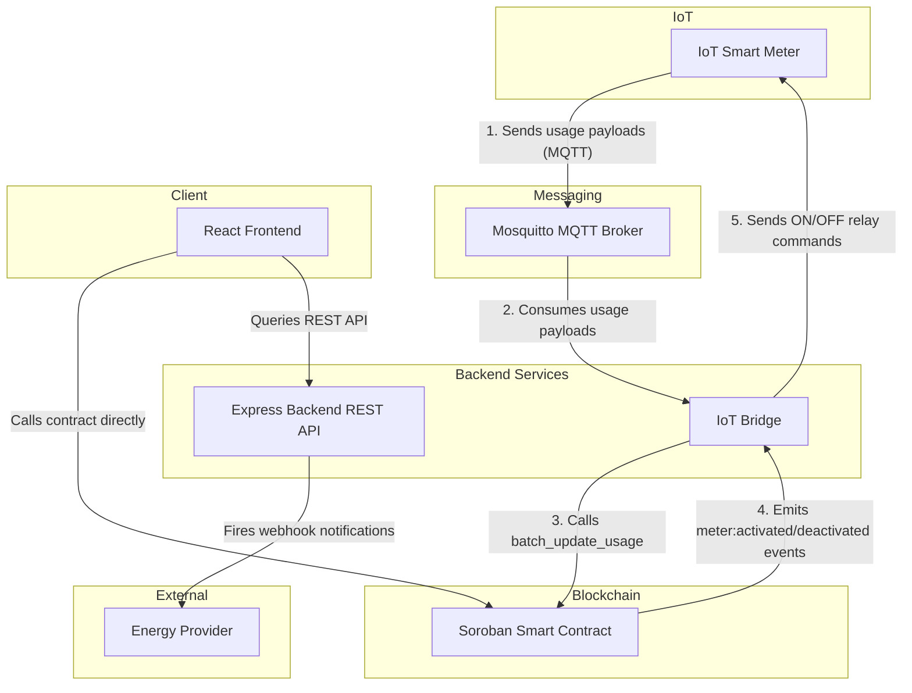

# Stellar SolarGrid

[](https://github.com/Dev-AdeTutu/Stellar-Solar-Grid/actions/workflows/ci.yml)

> Powering Africa with affordable, pay-as-you-go solar energy on blockchain.

Stellar SolarGrid is a decentralized PAYG solar energy platform built on [Soroban](https://soroban.stellar.org), within the Stellar ecosystem. Households and small businesses in underserved regions access solar electricity through flexible micro-payments — no large upfront costs required.

## Architecture



### System Flows

#### 1. PAYG (Pay-As-You-Go) Flow
Users purchase energy access through flexible payment plans (daily, weekly, or usage-based stablecoin payments) via the React Frontend dashboard, which interacts directly with the Soroban smart contract. The contract verifies the payment, activates the user's meter, and tracks the remaining energy units or time validity.

#### 2. Batch Update Flow
Rather than updating every usage update individually, the IoT Bridge consumes MQTT payloads sent by active smart meters to the Mosquitto broker, aggregates them, and calls `batch_update_usage` on the Soroban smart contract in a single batch transaction. This saves gas and transaction fees on the Stellar network.

#### 3. Allowlist Flow
To prevent unauthorized usage reports or unauthorized meter controls, an Allowlist checks and verifies that only registered smart meters (registered via the admin CLI/dashboard) can be active on the system. Additionally, the IoT Bridge/Oracle address is allowlisted on the smart contract to restrict usage updates to trusted nodes.

For local development setup and contributing guidelines, please refer to the [Contributing Guide](file:///Users/backenddevopsdeveloper/Downloads/DRIPS/viv-Stellar-Solar-Grid/CONTRIBUTING.md).

## Core Features

- **Smart Meter Integration** — IoT meters with real-time usage monitoring and on/off control
- **Flexible Payment Plans** — Daily, weekly, or usage-based micro-payments in stablecoins
- **Automated Access Control** — Smart contracts enable/disable electricity based on payment status
- **Energy Usage Tracking** — Dashboards for users and providers

## Getting Started

### Prerequisites

- [Rust](https://rustup.rs/) + `wasm32-unknown-unknown` target
- [Stellar CLI](https://developers.stellar.org/docs/tools/developer-tools/cli/stellar-cli)
- Node.js >= 18
- [Freighter Wallet](https://freighter.app/) (browser extension)

### Development with Makefile

A Makefile is provided at the repository root to simplify common development and smart contract deployment/invocation commands:

- **Build contracts**: `make build` compiles the contracts into WASM.
- **Run tests**: `make test` executes Cargo tests in the contracts folder.
- **Clean builds**: `make clean` runs `cargo clean` inside the contracts directory.
- **Deploy contract**: `make deploy NETWORK=testnet ADMIN_SECRET_KEY=<key>` deploys the built contract WASM to the specified network.
- **Invoke functions**:
  - `make invoke-register CONTRACT_ID=<id> ADMIN_SECRET_KEY=<key> METER_ID=<meter_id> OWNER=<owner>` registers a new meter.
  - `make invoke-allowlist CONTRACT_ID=<id> ADMIN_SECRET_KEY=<key> OWNER=<owner>` adds an owner to the allowlist.
- **Backend Logs**: `make logs` streams Docker Compose logs for the backend.

### Smart Contracts Deployment CI/CD

Contract deployments to the Stellar Testnet are automated via GitHub Actions:
- To trigger a deployment, push a git tag matching the pattern `contract-v*` (e.g., `git tag contract-v1.0.0 && git push origin contract-v1.0.0`).
- The workflow compiles the contract, installs Stellar CLI, and deploys it to the testnet using the `ADMIN_SECRET_KEY` secret.
- The new contract ID is printed as an output of the workflow.

### Running with Docker Compose and GHCR Images

You can pull and run the backend and frontend Docker images built automatically on pushes to `main` and release tags (`v*`):

```bash
docker pull ghcr.io/OWNER/solargrid-backend:latest
docker pull ghcr.io/OWNER/solargrid-frontend:latest
```
(Replace `OWNER` with the GitHub organization or username).

You can spin up the local infrastructure (MQTT broker and the backend service) using Docker Compose:

1. Copy the environment template at the repository root:
   ```bash
   cp .env.example .env
   ```
2. Populate the `.env` file — at minimum set `CONTRACT_ID`, `ADMIN_SECRET_KEY`, `ADMIN_ADDRESS`, and `VITE_CONTRACT_ID`. Every variable is documented with an inline comment in `.env.example`.
3. Start the services:
   ```bash
   docker compose up --build
   ```

The `env-check` service validates that all required environment variables are correctly populated before the backend starts up, preventing silent configuration errors.

### Observability

You can run the Prometheus and Grafana observability stack alongside the backend and MQTT services using the `observability` profile:

```bash
docker compose --profile observability up --build
```

- **Prometheus** scrapes the backend metrics (`/metrics`) every 15 seconds, and is accessible at `http://localhost:9090`.
- **Grafana** is preconfigured with the Prometheus datasource and is accessible at `http://localhost:3000` (default credentials: `admin` / `admin`). It features dashboard panels for MQTT messages/min, contract calls by method/status, and error rates.

## Smart Contract Overview

The `SolarGrid` contract manages:

| Function | Description |
|---|---|
| `register_meter(meter_id, owner)` | Register a new smart meter |
| `make_payment(meter_id, amount, plan)` | Pay for energy access |
| `check_access(meter_id)` | Check if meter is currently active |
| `get_usage(meter_id)` | Retrieve usage data |
| `update_usage(meter_id, units)` | Called by IoT oracle to update consumption |
| `deactivate_meter(meter_id)` | Admin-only: immediately deactivate a meter |

## Backend API

The full machine-readable API specification is available at [`backend/openapi.yaml`](backend/openapi.yaml) (OpenAPI 3.1). You can preview it with:

```bash
npx @redocly/cli preview-docs backend/openapi.yaml
```

### Meter Balance

**`GET /api/meters/:id/balance`**

Returns the live balance, usage, and active status for a single meter. Responses are cached for 5 seconds to reduce RPC load. The frontend `UserDashboard` polls this endpoint every 30 seconds.

**Response**

```json
{
  "meter_id": "METER1",
  "balance": 5000000,
  "units_used": 1200,
  "active": true
}
```

| Status | Description |
|---|---|
| 200 | Meter found, returns balance data |
| 404 | Meter not found |

## Contract Upgrades

The `Meter` struct carries a `version: u32` field (currently `1`). When the struct layout changes in a future release, existing persistent storage entries must be migrated before they can be read by the new code.

### Migration flow

1. Deploy the new contract WASM (the old entries remain in persistent storage).
2. For each registered meter, call the admin-only `migrate_meter(meter_id)` function.  
   It reads the entry as the previous schema (`LegacyMeter`) and writes it back as the current `Meter` v1.
3. Once all entries are migrated, the `LegacyMeter` type and `migrate_meter_v0` helper can be removed in a subsequent release.

```bash
# Example: migrate a single meter via Stellar CLI
stellar contract invoke \
  --id <CONTRACT_ID> \
  --source <ADMIN_SECRET> \
  --network testnet \
  -- migrate_meter --meter_id METER1
```

> **Note:** `migrate_meter` is idempotent per entry — calling it on an already-migrated meter will overwrite with the same data. Always test migrations on testnet before mainnet.

## Network

Deployed on Stellar Testnet. Switch to Mainnet for production.

## Deployment Security

- **Never commit `.env` files.** Copy `.env.example` to `.env` and populate locally.
- `ADMIN_SECRET_KEY` is loaded once at backend startup into a `Keypair` object; the raw secret string is not referenced anywhere after module initialisation.
- All error handlers log only `err.message` — raw error objects (which may contain XDR or serialised environment variables) are never logged.
- Enable secret scanning in CI (e.g. `git-secrets`, GitHub secret scanning) to prevent accidental key commits.

## License

MIT
